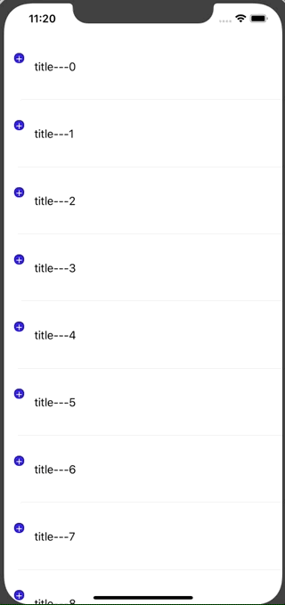

# InfiniteTree
一个可以无限展开的树状 TableView



最近在做项目的时候遇到了个上面图片所示的需求，基本要求就是能展开和收起一级树来显示和隐藏二级树。由于项目之前已经有了一种实现，本来是准备复用的。但是仔细阅读了一下之前的实现代码，发现封装的并不是很彻底，部分逻辑还是需要调用者进行处理。因此封装了现在这个可以无限展开的树状 TableView。

## 基本用法

1. 创建一个继承自 InfiniteTreeCell 的 TableViewCell
2. 重写 `- (UIView *)containView` 方法，返回要显示在 Cell 上的视图。

```
- (UIView *)containView
{
    return self.titleLab;
}
```
3. 定义一个模型类，实现 `InfiniteTreeModelDataProtocol` 协议的方法。

```
- (NSArray *)childrenModels
{
    return self.items;
}

- (NSString *)identifier
{
    return self.title;
}
```
4. 创建一个 tableView，以要展示的数据创建数据源数组 

```
_infiniteSource = [NSMutableArray arrayWithArray:[InfiniteTreeModel infiniteTreeModelArrayWithDataModels:self.dataSource]];
```

5. 在数据源方法中返回自定义的 Cell

```
- (NSInteger)tableView:(UITableView *)tableView numberOfRowsInSection:(NSInteger)section
{
    return self.infiniteSource.count;
}

- (UITableViewCell *)tableView:(UITableView *)tableView cellForRowAtIndexPath:(NSIndexPath *)indexPath
{
    TestCell *cell = [TestCell infiniteTreeCellWithTableView:tableView];
    cell.titleLab.text = [NSString stringWithFormat:@"%ld", (long)indexPath.row];
    InfiniteTreeModel *model = self.infiniteSource[indexPath.row];
    cell.model = model;
    return cell;
}
```

6. 在选中的代理方法中调用 tableView 分类的方法，来添加和删除行

```
- (void)tableView:(UITableView *)tableView didSelectRowAtIndexPath:(NSIndexPath *)indexPath
{
    [tableView deselectRowAtIndexPath:indexPath animated:NO];
    [tableView if_dealSelectAtIndexPath:indexPath sourceArray:self.infiniteSource];
}
```

通过上面几步就可以实现了展开收起的功能，具体能展开几层完全取决于相关数据。而使用者只需要专注于实现业务相关代码就行了。

## 原理解析
在设计的时候主要的思路
1. 封装 
    左侧的按钮显示以及每行应该显示什么不应该有调用者处理，需要进行封装
2. 抽象
    在具体项目中每个模块中服务器返回的数据类型可能都不一样，因此需要抽象出来一个接口，OC 中就是协议。

### 模型 InfiniteTreeModel
在上面思路的指导下首先想到的就是数据结构中的树，因此创建一个模型类来描述树的每个节点，比如父节点和子节点信息，以及该节点的打开还是关闭等等信息。

```
@property (nonatomic, assign) BOOL isOpen;
@property (nonatomic, assign) BOOL isLastDot;
@property (nonatomic, weak) InfiniteTreeModel *parentModel;
```

然后声明一个协议

```
@protocol InfiniteTreeModelDataProtocol <NSObject>

@required;
- (NSArray *)childrenModels;
// 用于删除节点
- (NSString *)identifier;

@end
```

每个需要展开的数据都需要实现这个协议，并且通过这个协议节点模型的子节点的信息就能通过 childrenModels 来获取到。

```
@property (nonatomic, strong) id<InfiniteTreeModelDataProtocol> dataModel;
```

然后在创建数据源的时候通过 InfiniteTreeModel 的类方法来创建第一级显示的模型

```
+ (NSArray <InfiniteTreeModel *>*)infiniteTreeModelArrayWithDataModels:(NSArray<id<InfiniteTreeModelDataProtocol>> *)dataModels
{
    NSMutableArray *array = [NSMutableArray array];
    for (int i = 0; i < dataModels.count; i++) {
        InfiniteTreeModel *model = [[InfiniteTreeModel alloc] init];
        model.dataModel = dataModels[i];
        if (i == dataModels.count - 1) {
            model.isLastDot = YES;
        }
        [array addObject:model];
    }
    return array;
}
```

当点击某一行需要展开的时候插入数据通过下面三个方法来获取插入的模型和插入的位置

```
- (NSArray <InfiniteTreeModel *>*)insertTreeModels;
- (NSArray *)insertTreeModelsIndexPathsWithStartIndex:(NSInteger)startIndex;
- (NSIndexSet *)insertTreeModelsIndexSetWithStartIndex:(NSInteger)startIndex;
```
最主要的方法就是 insertTreeModels 。这个方法通过当前模型的 childrenModels 来创建子节点的模型。

```
- (NSArray <InfiniteTreeModel *>*)insertTreeModels
{
    if (!self.hasChildren) return nil;
    
    NSMutableArray *array = [NSMutableArray array];
    NSInteger count = self.dataModel.childrenModels.count;
    for (int i = 0; i < count; i++) {
        InfiniteTreeModel *model = [[InfiniteTreeModel alloc] init];
        model.dataModel = self.dataModel.childrenModels[i];
        model.parentModel = self;
        if (i == count - 1) {
            if (self.isLastDot) {
                model.isLastDot = YES;
            } else if (model.parentModel && !model.parentModel.parentModel) { // 对第二级做额外的处理
                model.isLastDot = YES;
            }
        }
        [array addObject:model];
    }
    return array;
}

```

收起的时候通过下面方法来获取将要删除的模型的位置

```
- (NSIndexSet *)qureyTreeModelsWithSource:(NSArray<InfiniteTreeModel*>*)source;
- (NSArray *)getDeleteIndexPathsWithIndexSet:(NSIndexSet *)indexSet;
```

主要的就是 qureyTreeModelsWithSource 方法，通过对比 identifier 来递归的删除数据源中的数据。

```
- (NSIndexSet *)qureyTreeModelsWithSource:(NSArray<InfiniteTreeModel*>*)source
{
    if (!self.hasChildren) return [NSIndexSet indexSet];
    
    NSMutableIndexSet *set = [NSMutableIndexSet indexSet];

    NSInteger count = source.count;
    for (int i = 0; i < count; i++) {
        InfiniteTreeModel *model = source[i];
        if ([[self.dataModel identifier] isEqualToString:[model.parentModel.dataModel identifier]]) {
            [set addIndex:i];
            [set addIndexes:[model qureyTreeModelsWithSource:source]];
        } else {
            continue;
        }
    }
    return set;
}
```

### Cell InfiniteTreeCell
主要的展开收起逻辑由模型类来进行处理，因此 Cell 的任务就相对简单的多了，主要就是根据模型来展示相关数据就可以了。

### TableView 扩展 UITableView (InfiniteTree)

这个分类主要用于封装展开收起的逻辑

```
- (void)if_dealSelectAtIndexPath:(NSIndexPath *)indexPath sourceArray:(NSMutableArray *)sourceArray
{
    InfiniteTreeModel *model = sourceArray[indexPath.row];
    if (!model.hasChildren) return;
    
    if (model.isOpen) {
        model.isOpen = NO;
        NSIndexSet *deleteIndexSet = [model qureyTreeModelsWithSource:sourceArray];
        [sourceArray removeObjectsAtIndexes:deleteIndexSet];
        NSArray *deleteIndexPaths = [model getDeleteIndexPathsWithIndexSet:deleteIndexSet];
        [self deleteRowsAtIndexPaths:deleteIndexPaths withRowAnimation:UITableViewRowAnimationNone];
    } else {
        model.isOpen = YES;
        NSIndexSet *insertIndexSet = [model insertTreeModelsIndexSetWithStartIndex:indexPath.row];
        NSArray *insertModels = [model insertTreeModels];
        [sourceArray insertObjects:insertModels atIndexes:insertIndexSet];
        [self insertRowsAtIndexPaths:[model insertTreeModelsIndexPathsWithStartIndex:indexPath.row] withRowAnimation:UITableViewRowAnimationNone];
    }
    [self reloadRowsAtIndexPaths:@[indexPath] withRowAnimation:UITableViewRowAnimationNone];
}
```

